<div align="center">


# hashface

**Every string deserves a face.**

Deterministic, dependency-free SVG avatars in a bold-blocks style.<br>
Same string in, same face out. Every single time.

[](https://github.com/Waiivyy/hashface/actions/workflows/ci.yml)


[](LICENSE)

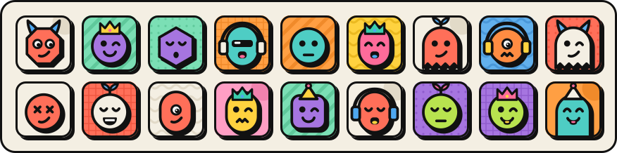

<br>

</div>

Hand hashface any string (a username, an email, the name of your cat) and it draws a small, slightly smug character for it: thick black outlines, flat bold colors and a hard shadow that means business. The same string always gets the same character. Nearby strings like `user1` and `user2` get different shapes and faces, not just a fresh coat of paint.

Think of it as an identicon that went to art school.

## Why hashface

- **Deterministic.** The same input produces a byte-identical SVG, and golden-snapshot tests hold the line.
- **Actually different.** Neighboring strings change shape and face, not only color. The test suite checks this over 10,000 neighboring pairs.
- **Tiny.** Zero dependencies, about 6 KB gzipped, about 1 KB of SVG per avatar.
- **Safe to inline.** No ids, no scripts, no external references, and the seed never appears in the output, so an email used as a seed stays out of your markup.
- **Runs where your code runs.** Plain ES modules for browsers, Node and bundlers, with TypeScript types included.

## Quick start

```bash
npm install github:Waiivyy/hashface
```

```js
import { generateAvatar } from 'hashface';

const svg = generateAvatar('alice@example.com', { size: 96 });
document.querySelector('#avatar').innerHTML = svg;
```

That's the whole setup. No API key, no network, no canvas required.

> hashface is not on the npm registry yet, so the command above installs it straight from GitHub.

## Meet the crew

Every one of these is just a string. Run `generateAvatar` on the same names and you will get exactly these faces.

|  |  | 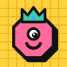 | 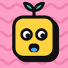 | 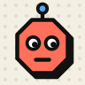 |  |  | 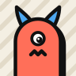 |
| :-: | :-: | :-: | :-: | :-: | :-: | :-: | :-: |
| `alice` | `bob` | `carol` | `dave` | `eve` | `mallory` | `trent` | `peggy` |

## Usage

### Options

```js
generateAvatar('alice', { size: 128, title: 'Avatar for Alice' });
```

| Option   | Type     | Default | What it does                                                                         |
| -------- | -------- | ------- | ------------------------------------------------------------------------------------ |
| `size`   | `number` | `64`    | Width and height in pixels. The drawing scales cleanly; the viewBox is always `0 0 64 64`. |
| `traits` | `object` | none    | Traits to lock by name instead of deriving them from the seed, e.g. `{ mouth: 'grin' }`. |
| `title`  | `string` | none    | An accessible title. Adds `role="img"` and an escaped `<title>`.                     |

### Swap a mouth, keep the rest

`getTraits` tells you what an avatar is made of, and `traitNames` lists every variant. Together they let you keep a face and change one part, for example behind a "new mouth" button:

```js
import { generateAvatar, getTraits, traitNames } from 'hashface';

const current = getTraits('alice'); // { shape: 'circle', eyes: 'wink', mouth: 'smirk', ... }
const mouths = traitNames.mouth;
const nextMouth = mouths[(mouths.indexOf(current.mouth) + 1) % mouths.length];

generateAvatar('alice', { traits: { mouth: nextMouth } }); // same alice, new mouth
```

Locking one trait never changes the others.

### In the browser

```js
import { generateAvatar, renderToCanvas, toDataUri } from 'hashface';

// As an image
img.src = toDataUri(generateAvatar('alice', { size: 96 }));

// Inline. Safe: the output has no scripts, no ids and no seed text.
container.innerHTML = generateAvatar('alice', { size: 96 });

// On a canvas, scaled to the canvas size
await renderToCanvas(canvas, generateAvatar('alice'));
```

Avatars are square. For round ones, add `border-radius: 50%` in CSS.

### In Node

```js
import { writeFileSync } from 'node:fs';
import { generateAvatar } from 'hashface';

writeFileSync('alice.svg', generateAvatar('alice', { size: 256 }));
```

CommonJS works too, on Node versions that can `require` ES modules (20.19+ and 22.12+):

```js
const { generateAvatar } = require('hashface');
```

## API

| Export                           | What it does                                                               |
| -------------------------------- | -------------------------------------------------------------------------- |
| `generateAvatar(seed, options?)` | Returns the avatar as an SVG string.                                       |
| `getTraits(seed, locks?)`        | Returns the trait names the avatar is drawn from.                          |
| `traitNames`                     | Every variant name per category, frozen.                                   |
| `toDataUri(svg)`                 | Wraps an SVG string in a `data:image/svg+xml` URI for `` or CSS.  |
| `renderToCanvas(canvas, svg)`    | Draws an SVG string onto a canvas and returns a promise. Browser only.     |

Mistakes fail loudly instead of quietly drawing the wrong face:

- A seed that is not a string throws `TypeError`. Convert numeric ids with `String(id)`.
- A `size` that is not a positive finite number throws `RangeError`.
- An unknown trait name throws `RangeError` and lists the valid names.

## The traits

Every avatar is one pick from each of six categories: 196,608 combinations, 4,096 of which differ in shape or face. Here is every variant, modeled by the mascot. Use these names with the `traits` option.

**Shapes**

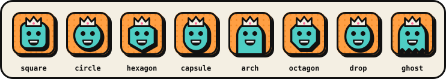

**Eyes**

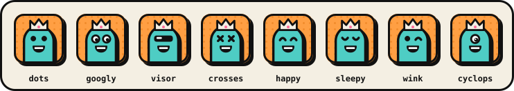

**Mouths**

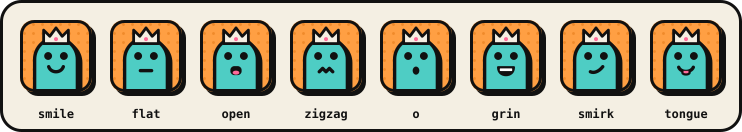

**Accessories**

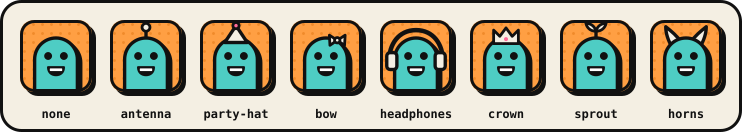

**Patterns**

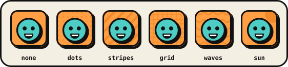

**Palettes**

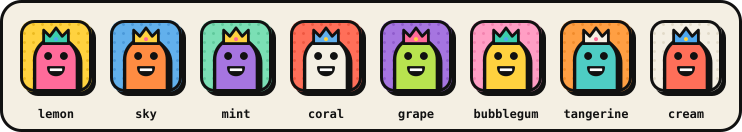

## Anatomy of a face

Every avatar is stacked from the same layers in the same order. Here is `mallory`, assembled one layer at a time:

|  |  |  |  |  |
| :-: | :-: | :-: | :-: | :-: |
| background | head | eyes | mouth | accessory |

Under the hood:

1. The seed is encoded as UTF-8, hashed with FNV-1a, and expanded into eight 32-bit words, so every input bit affects every output bit.
2. Each trait category reads its own word, so categories are independent of each other.
3. Within a category, the variant is picked by rendezvous hashing: every variant name gets a score and the highest wins. Adding a variant later only changes the avatars the new variant wins.
4. Each variant is drawn inside a reserved zone, and the tests check every one, so no combination of traits can overlap.

The full design, with the reasoning behind each decision, is in [docs/design.md](docs/design.md).

## FAQ

<details>
<summary><b>Can two strings get the same face?</b></summary>

Yes, occasionally. There are 196,608 combinations, so in a team of 100 people the chance that any two share a face is about 2.5%. In a community of 1,000 users, expect two or three identical pairs. If that matters, give a user a fresh face with a suffix such as `` generateAvatar(`${userId}:2`) ``, or lock a trait.
</details>

<details>
<summary><b>Why does <code>Alice</code> look nothing like <code>alice</code>?</b></summary>

Seeds are hashed exactly as given, down to the last byte. If they should match, normalize first, for example with `seed.trim().toLowerCase()`.
</details>

<details>
<summary><b>Will my avatars change when I upgrade?</b></summary>

Not within a major version. Golden-snapshot tests pin the exact output, and any change to an existing avatar ships as a new major version.
</details>

<details>
<summary><b>Does it need a browser?</b></summary>

No. `generateAvatar` is a pure function that returns a string, so it runs on servers, in workers and in build scripts. Only `renderToCanvas` needs a browser.
</details>

<details>
<summary><b>Can I change the colors?</b></summary>

Lock any of the eight palettes with `traits: { palette: 'mint' }`. More palette families are planned; adding one will never recolor existing avatars.
</details>

## Demo

The repo includes a small playground: type anything, swap traits, download SVG or PNG.

```bash
npm run demo
```

Then open <http://127.0.0.1:5173/demo/>.

## Contributing

Issues and pull requests are welcome. Development needs Node 22.18 or newer, which runs the TypeScript sources and tests directly.

```bash
npm install
npm test               # unit, zone, golden and API tests
npm run typecheck
npm run pack:check     # builds, packs and test-installs the package
node scripts/sheet.ts  # writes preview/sheet.html with every variant
```

Adding a variant? Draw it in `src/traits/`, keep it inside its zone (the zone tests will tell you when it strays), check it on the contact sheet, and refresh the README images with `node scripts/examples.ts`. New variants change some existing avatars, so they ship in a major version.

## License

[MIT](LICENSE) © 2026 Waiivyy

<div align="center">
<br>
  
<br>
<sub>The crew says hi.</sub>
</div>
